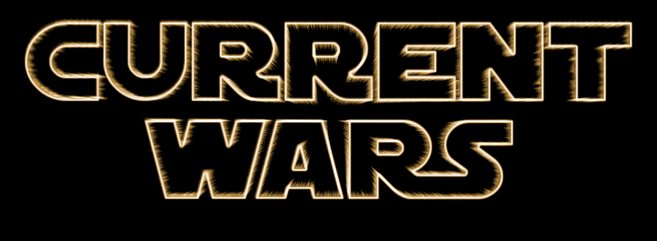
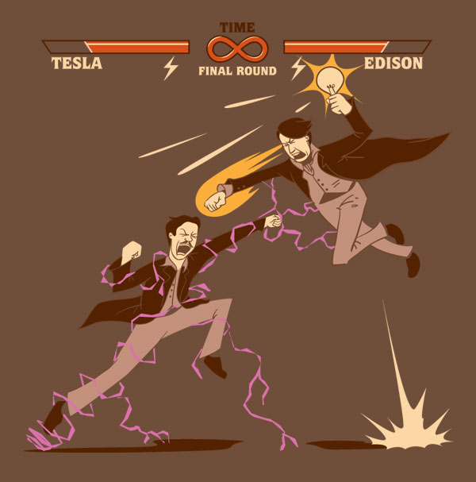
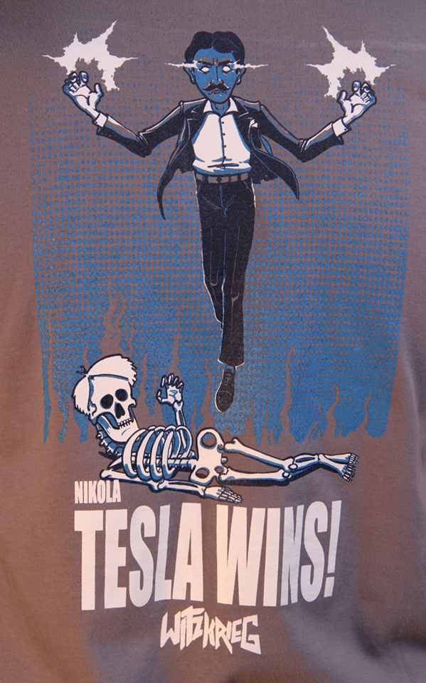

#  Edison vs. Westinghouse/Tesla

a.k.a. AC vs DC

.fx: titleslide

---

# Historical context
 * late 1880s

---

# Direct current

  > Edison was the pioneer in building power systems, beginning in New York 
  > City in 1882.

<small>*Reference* : The Art of Standard Wars, Carl Shapiro and Hal R. Varian</small>

--- 

# (About Edison)

* 22 other "pioneers" before him

  > Edison was not a geek; he was a CEO.

<small>*Reference* : http://theoatmeal.com/comics/tesla</small>
<small>which relies on http://www.history.com/news/the-renegade-roots-of-hollywood-studios/ and Tesla, Man Out Of Time</small>

---

# Pros / Cons

* (+) More efficient at generating power
* (-) Small distances between generating station and user (1 mile)

<small>*Reference* : The Art of Standard Wars, Carl Shapiro and Hal R. Varian</small>

---

# Alternative current

* Based on Faraday's theory

> 1832 : Parisian instrument maker Hyppolyte Pixii builds a small machine, 
> known today as a magneto, capable of producing alternating current.

<small>*Reference* : http://www.magnet.fsu.edu/education/tutorials/timeline/1830-1839.html</small>

---

# Pros / Cons

* (+) Thinner wires, more distance
* (+) Higher voltages possible
* (+) Easy voltage change (transformer)
* (-) Less efficient at generating power

---

# What problem does AC/DC solve?

> Electricity distribution is the final stage in the delivery of electricity 
> to end users. A distribution system's network carries electricity from the 
> transmission system and delivers it to consumers. 

<small>*Reference* : http://en.wikipedia.org/wiki/Electricity_distribution</small>

---

# Why not both?

<small>*Soure* : http://a.tgcdn.net/images/products/additional/large/</small>

---

# Standardization, a necessity?

> unlike railroads, however standardization was less of an imperative in
> electricity. Indeed, the two technologies initially did not compete 
> directly, but were deployed in regions suited to their relative strengths.

<small>*Reference* : The Art of Standard Wars, Carl Shapiro and Hal R. Varian</small>

--- 

# Agressive competition

> Edison and his compatriots did not take kindly to the competition.
> _[here, related to filmmaking, note from @mriehl]_

> Edison, not wanting to lose the royalties he was earning from his direct 
> current patents, began a campaign to discredit alternating current.

<small>*References* :

http://www.history.com/news/the-renegade-roots-of-hollywood-studios/ 

http://energy.gov/articles/war-currents-ac-vs-dc-power</small>

---

# Agressive competition

* Showdowns in marketplaces, courtrooms, political arenas, public relations, academia

<small>*Reference* : The Art of Standard Wars, Carl Shapiro and Hal R. Varian</small>

---

# Agressive competition

* Edison and his "marketing"

<small>*References* : 

The Art of Standard Wars, Carl Shapiro and Hal R. Varian

http://theoatmeal.com/comics/tesla

https://www.pbs.org/tesla/ll/ll_warcur.html</small>

---

# Outcome

---

# So why did AC prevail? 

 * Superior technology

> A first-mover advantage (of DC) can be overcome by superior 
> technology (of AC).

<small>*Reference* : The Art of Standard Wars, Carl Shapiro and Hal R. Varian</small>

---

# So why did AC prevail? 

 * Ongoing innovation

> Ongoing innovation (here, polyphase AC) can lead to victory 
> in a standards war.

<small>*Reference* : The Art of Standard Wars, Carl Shapiro and Hal R. Varian</small>

---

# So why did AC prevail?

 * Cheaper in some situations, impressive events (e.G. Niagara)

> General Electric bid to electrify the fair using Edison’s direct current for 
> $554,000, but lost to George Westinghouse, who said he could power the fair 
> for only $399,000 using Tesla’s alternating current.

 <small>*Reference* : http://energy.gov/articles/war-currents-ac-vs-dc-power</small>

---

# So why did AC prevail?

 * Edison backs out, General Electrics uses AC

<small>*Reference* : http://fr.wikipedia.org/wiki/Guerre_des_courants</small>

---

# IMHO

* This is one of the debates where the common people actually didn't have much of a choice
* Thus, lobbying and marketing at its worst
* AC superior due to pros/cons at the time (coverage, now starts to shift again)

---

# Thanks!

.fx: titleslide
